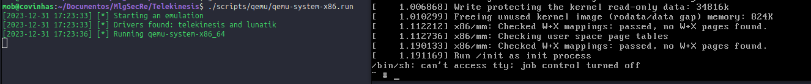

# crowamor: Qemu Tools

Utilities used for developing the Telekinesis driver.

* [qemu-system-x86.run](#qemu-system-x86run)

## qemu-system-x86.run

This script is used to launch an instance using qemu_system_x86_64. It is important to note that to run the script, you need to have qemu-system installed. Additionally, you need to compile both the dependency and Telekinesis and Modules using the [Makefile](../../../Makefile).

Otherwise, you may encounter issues running the script.

The script checks whether the components have been compiled before compressing the busybox [initramfs](../../../scripts/qemu/initramfs). Then, it moves all necessary components to initramfs and executes qemu. Keep in mind that it uses your kernel to launch an instance (/boot/vmlinuz).

To successfully run the script, ensure that you are in the root of the project and then execute `./scripts/qemu/qemu-system-x86.run`.

Qemu is running...
